# Hợp Đồng Chất Lượng Dữ Liệu Địa Điểm (Data Quality Contract)

> **Dự án:** ViVuTraVinh — Cẩm nang du lịch tự túc & bản đồ số Trà Vinh
> **Phiên bản áp dụng:** v2.1.0+ (Mốc G9.1)
> **Mục đích:** Thiết lập chuẩn mực chất lượng dữ liệu du lịch nhằm đảm bảo mọi địa điểm được phê duyệt và hiển thị công khai đều có thông tin thực tế, an toàn, có thể định vị và kiểm chứng được.

---

## 1. Nguyên Tắc Cốt Lõi

1. **Không suy đoán dữ liệu (No AI Speculation):** Tuyệt đối không tự động điền các thông tin chưa được kiểm chứng như khu vực (`area`), số điện thoại, giờ mở cửa hoặc tọa độ giả. Trường nào thiếu phải để trống hoặc hiển thị trạng thái chưa xác minh.
2. **Bảo toàn dữ liệu di sản (Legacy Tolerance):**
   - Các địa điểm ở trạng thái bản nháp (`draft`) hoặc đang ẩn (`hidden`) được phép thiếu các trường xác minh (`area`, địa chỉ, GPS, giờ, giá...) mà không bị chặn lưu hay chỉnh sửa.
   - Khi chỉnh sửa một bản ghi vốn đã `approved` trước đó (legacy approved place) nhưng chỉ cập nhật các trường như `note`, `description`, `contact`..., hệ thống áp dụng chế độ tương thích legacy, không chặn chỉ vì các trường cũ còn thiếu.
   - Tuy nhiên, nếu bản cập nhật trực tiếp cung cấp URL, tọa độ GPS hoặc hình ảnh nguy hiểm/sai cú pháp thì bắt buộc phải bị chặn.
3. **Phân định rõ Ranh giới ERROR và WARNING:**
   - **`ERROR` (Chặn duyệt):** Các lỗi vi phạm cấu trúc nghiêm trọng:
     - Tên rỗng, dưới 3 ký tự hoặc vượt quá 150 ký tự.
     - Slug sai định dạng URL chuẩn.
     - Thiếu danh mục (`category`) hoặc thiếu khu vực (`area`) khi duyệt xuất bản.
     - Tọa độ GPS sai cú pháp hoặc nằm ngoài phạm vi địa lý tỉnh Trà Vinh.
     - Đường dẫn Google Maps không dùng HTTPS, tên miền không thuộc allowlist hoặc chứa scheme nguy hại.
     - Hình ảnh chứa giao thức nguy hiểm (`javascript:`, `data:`, `ftp:`, `blob:`, `//`...).
     - Giờ hoạt động (`opening_time`, `closing_time`) cung cấp sai định dạng 24h `HH:mm`.
     - Địa điểm có bất kỳ lỗi nào thuộc nhóm này sẽ **bị chặn tuyệt đối** không thể duyệt sang trạng thái `approved`.
   - **`WARNING` (Khuyến nghị hoàn thiện):** Cảnh báo về độ đầy đủ của thông tin du lịch (chưa có địa chỉ chi tiết, chưa có GPS, chưa có giờ mở cửa, chưa có giá, thiếu ảnh, ảnh Google Drive...). Cảnh báo không chặn thao tác duyệt nhưng khuyến khích người kiểm duyệt hoàn thiện.
4. **Không thay đổi Schema trong G9.1:** Sử dụng 100% các cột CSDL hiện có (`coordinates`, `map_link`, `price_raw`, `opening_time`, `closing_time`, `display_hours`...). Tuyệt đối không tạo cột mới và không chạy migration DDL.

---

## 2. Phân Tầng Dữ Liệu Địa Điểm (`places`)

```mermaid
graph TD
    A["Dữ liệu Địa Điểm (places)"] --> B["1. required-for-approval (ERROR nếu thiếu)"]
    A --> C["2. verified-for-public (WARNING nếu thiếu)"]
    A --> D["3. optional (Tùy chọn)"]

    B --> B1["name (3–150 ký tự)"]
    B --> B2["slug (^[a-z0-9]+(?:-[a-z0-9]+)*$)"]
    B --> B3["category & area (chuỗi không rỗng)"]
    B --> B4["status (approved|draft|hidden|archived)"]
    B --> B5["Cú pháp GPS hợp lệ & trong Trà Vinh"]
    B --> B6["URL Maps HTTPS hợp lệ, không độc hại"]
    B --> B7["Giờ HH:mm 24h hợp lệ (nếu có nhập)"]
    B --> B8["Ảnh an toàn (https, http, local asset)"]

    C --> C1["address (Địa chỉ chi tiết)"]
    C --> C2["coordinates (Tọa độ định vị)"]
    C --> C3["map_link (Đường dẫn Google Maps)"]
    C --> C4["Giờ mở cửa / đóng cửa / display_hours"]
    C --> C5["contact (Điện thoại / Liên hệ)"]
    C --> C6["price_raw (Khoảng giá / Miễn phí)"]
    C --> C7["Hình ảnh đại diện"]

    D --> D1["description (Mô tả chi tiết)"]
    D --> D2["note (Lưu ý trải nghiệm)"]
    D --> D3["images (Bộ sưu tập ảnh phụ)"]
    D --> D4["is_featured, contributor, sort_order"]
```

### 2.1. Nhóm `required-for-approval` (Bắt buộc để được duyệt)

Vi phạm bất kỳ điều kiện nào dưới đây sẽ tạo ra mã lỗi **`ERROR`** và bị từ chối phê duyệt:

| Trường | Quy cách & Ràng buộc kỹ thuật | Mã lỗi (`code`) | Mức độ |
| :--- | :--- | :--- | :---: |
| `name` | Chuỗi ký tự đã cắt tỉa (trimmed), độ dài bắt buộc từ 3 đến 150 ký tự (dưới 3 ký tự hoặc trên 150 ký tự đều bị từ chối). | `INVALID_NAME` | **ERROR** |
| `slug` | Phải khớp định dạng URL an toàn: `^[a-z0-9]+(?:-[a-z0-9]+)*$`. Cấm chữ hoa, khoảng trắng, ký tự có dấu, dấu gạch nối kép `--`, hoặc dấu gạch nối ở đầu/cuối. | `INVALID_SLUG` | **ERROR** |
| `category` | Bắt buộc chọn danh mục (kiểm tra chuỗi không rỗng sau khi trim; hệ thống hiện tại chưa áp dụng allowlist taxonomy cứng trong G9.1). | `MISSING_CATEGORY` | **ERROR** |
| `area` | Bắt buộc xác định khu vực / địa bàn hành chính khi duyệt xuất bản (kiểm tra chuỗi không rỗng sau khi trim; hệ thống hiện tại chưa áp dụng allowlist địa bàn cứng trong G9.1; bản ghi draft được phép để trống). | `MISSING_AREA` | **ERROR** |
| `status` | Phải thuộc một trong 4 trạng thái: `approved`, `draft`, `hidden`, `archived`. | `INVALID_STATUS` | **ERROR** |
| `coordinates` *(nếu có)* | Nếu có dữ liệu, phải tuân thủ cú pháp `"lat,lng"` với strict decimal regex (`/^[+-]?\d+(?:\.\d+)?$/`), chỉ parse `Number` sau khi regex toàn chuỗi đã đạt, và phải nằm trong **Hộp giới hạn địa lý tỉnh Trà Vinh**. | `INVALID_COORDINATES_FORMAT` `COORDINATES_OUT_OF_BOUNDS` | **ERROR** |
| `map_link` *(nếu có)* | Nếu có dữ liệu, bắt buộc phải dùng giao thức `https:` và hostname phải thuộc **Exact Allowlist của Google Maps**. Chặn tuyệt đối `javascript:`, `data:`, protocol-relative `//` và tên miền lừa đảo (ví dụ `google.com.evil.test`). | `INSECURE_MAP_URL` `DISALLOWED_MAP_HOST` | **ERROR** |
| `image_link` / `images` | Chỉ chấp nhận các đường dẫn an toàn: `https://`, `http://` hoặc đường dẫn local asset an toàn (`/`, `./`, `images/`, `assets/`). Chặn dứt khoát path traversal (segment `..`, `.`, backslash, `%2e%2e`, `%2E%2E`, `%5c`). Chặn tuyệt đối `javascript:`, `data:`, `vbscript:`, `file:`, `ftp:`, `blob:`, protocol-relative `//` và các giao thức lạ. | `INSECURE_IMAGE_URL` | **ERROR** |
| `opening_time` / `closing_time` *(nếu có)* | Nếu có dữ liệu, bắt buộc phải đúng định dạng 24h `HH:mm` (từ `00:00` đến `23:59`). Sai định dạng là ERROR ở cả mode approval lẫn draft. `display_hours` là chuỗi hiển thị legacy, không dùng để hợp thức hóa giờ sai. | `INVALID_TIME_FORMAT` | **ERROR** |

### 2.2. Nhóm `verified-for-public` (Cần xác minh trước khi công khai)

Nếu thiếu các trường này, hệ thống sẽ ghi nhận **`WARNING`**. Cảnh báo được hiển thị nổi bật trên giao diện quản trị và báo cáo kiểm toán, nhưng không chặn quyền xuất bản khi quản trị viên đã xác nhận:

| Trường | Tiêu chuẩn chất lượng du lịch | Mã cảnh báo (`code`) |
| :--- | :--- | :--- |
| `address` | Thiếu địa chỉ chi tiết khiến khách du lịch khó tìm đến điểm đến. | `WARN_MISSING_ADDRESS` |
| `coordinates` | Thiếu tọa độ GPS khiến địa điểm không thể cắm cờ chính xác trên Bản đồ tương tác Leaflet. | `WARN_MISSING_COORDINATES` |
| `map_link` | Thiếu liên kết chỉ đường Google Maps trực tiếp. | `WARN_MISSING_MAP_LINK` |
| `contact` | Thiếu số điện thoại hoặc kênh liên hệ khi cần đặt chỗ hoặc hỏi thông tin. | `WARN_MISSING_CONTACT` |
| `price_raw` | Thiếu thông tin khoảng giá. *(Lưu ý: Các giá trị như `"0đ"`, `"Miễn phí"` được coi là ĐÃ XÁC MINH, không bị coi là thiếu).* | `WARN_MISSING_PRICE` |
| `image_link` / `images` | Địa điểm chưa có ảnh đại diện hoặc bộ ảnh minh họa. | `WARN_MISSING_IMAGES` |
| `image_link` (Google Drive) | Ảnh sử dụng liên kết Google Drive (`drive.google.com` hoặc `docs.google.com`) có khả năng chưa mở quyền truy cập công khai hoặc không nhúng trực tiếp được vào web. | `WARN_DRIVE_IMAGE_LINK` |
| Giờ mở cửa / đóng cửa | Thiếu cả `opening_time`, `closing_time` và `display_hours`, hoặc chỉ có 1 đầu mở/đóng mà không có giờ kết thúc. *(Lưu ý: Hỗ trợ khung giờ qua đêm như `18:00 - 02:00`; giá trị `00:00` là hợp lệ, không bị coi là thiếu).* | `WARN_MISSING_HOURS` `WARN_INCOMPLETE_HOURS` |
| `description` | Mô tả quá ngắn (dưới 20 ký tự) hoặc chưa có tóm tắt trải nghiệm. | `WARN_SHORT_DESCRIPTION` |

### 2.3. Nhóm `optional` (Tùy chọn)

- `note`: Ghi chú nội bộ hoặc mẹo đi lại cho khách du lịch.
- `images`: Danh sách ảnh phụ dạng mảng chuỗi.
- `contributor`: Tên hoặc email người đóng góp nội dung.
- `sort_order`: Thứ tự ưu tiên hiển thị (số nguyên).
- `is_featured`: Đánh dấu địa điểm nổi bật (`boolean`).
- `operating_status`: Trạng thái hoạt động thực tế (`Normal`, `Temporarily Closed`, `Permanently Closed`).

---

## 3. Quy Chuẩn Kỹ Thuật Chi Tiết

### 3.1. Tên Địa Điểm & URL Slug
- **Tên địa điểm (`name`):** Bắt buộc từ 3 đến 150 ký tự sau khi cắt tỉa khoảng trắng. Dưới 3 ký tự (ví dụ: `"Ao"`) hoặc vượt quá 150 ký tự đều bị từ chối với mã lỗi `INVALID_NAME`.
- **URL Slug (`slug`):** Chỉ gồm các ký tự ASCII viết thường (`a-z`), số (`0-9`) và dấu gạch nối đơn (`-`). Không chứa ký tự có dấu tiếng Việt, không chứa khoảng trắng, không bắt đầu hoặc kết thúc bằng gạch nối.

### 3.2. Hộp Giới Hạn Tọa Độ Tỉnh Trà Vinh & Strict Decimal Parser

Tọa độ GPS của địa điểm thuộc Trà Vinh bắt buộc phải nằm trong phạm vi hình học:
- **Vĩ độ Bắc (Latitude):** `9.2500°N` đến `10.1500°N`
- **Kinh độ Đông (Longitude):** `105.8000°E` đến `106.7000°E`

**Quy tắc thẩm định tọa độ:**
1. Chuỗi `coordinates` được phân tách bởi dấu phẩy `,` thành đúng 2 phần: `latitude` và `longitude` (cho phép khoảng trắng quanh dấu phẩy).
2. **Strict Regex Parser:** Trước khi parse số, mỗi thành phần vĩ độ / kinh độ phải khớp toàn bộ chuỗi số thập phân hợp lệ theo biểu thức:
   `^[+-]?\d+(?:\.\d+)?$`
   - Chấp nhận: `9.9347,106.3449`, ` 9.9347 , 106.3449 `, `+9.9347,+106.3449`
   - Cho phép dấu `+` hoặc `-` ở đầu.
   - Từ chối dứt khoát:
     - Ký tự chữ cái: `9.9347abc,106.3449`, `9.9347,106.3449xyz`
     - Ký hiệu số mũ / khoa học: `9e0,106.3`
     - Giá trị đặc biệt: `Infinity,106.3`, `-Infinity,106.3`, `NaN,106.3`
     - Nhiều dấu chấm thập phân: `9..3,106.3`
3. **Chuyển đổi Number & Finite Check:** Chỉ thực hiện `Number()` sau khi regex toàn chuỗi đã đạt; cả 2 giá trị phải là số thực hữu hạn (`Number.isFinite()`).
4. **Bounding Box Validation:** Sau khi đạt định dạng số, kiểm tra tọa độ phải nằm trong Bounding Box Trà Vinh.
5. Điểm mốc tham chiếu thực tế:
   - Trung tâm TP Trà Vinh / Ao Bà Om: `9.9347, 106.3449` *(Hợp lệ)*
   - Biển Ba Động (Duyên Hải): `9.6115, 106.5775` *(Hợp lệ)*
   - Cù Lao Tân Qui (Cầu Kè): `9.8750, 106.0800` *(Hợp lệ)*
   - TP Hồ Chí Minh: `10.7769, 106.7009` *(BỊ CHẶN - Ngoài Trà Vinh)*
   - Hà Nội: `21.0285, 105.8542` *(BỊ CHẶN - Ngoài Trà Vinh)*
   - Đảo ngược tọa độ (`106.3449, 9.9347`): *(BỊ CHẶN - Out of bounds)*

### 3.3. Allowlist Tên Miền Google Maps (Hostname Exact Allowlist)

Chỉ chấp nhận các đường dẫn Google Maps hợp lệ:
- Giao thức bắt buộc: `https:` (tuyệt đối không dùng `http:`).
- Hostname phải khớp chính xác danh sách sau:
  - `maps.google.com`
  - `www.google.com` (đường dẫn phải bắt đầu bằng `/maps`)
  - `google.com` (đường dẫn phải bắt đầu bằng `/maps`)
  - `www.google.com.vn` (đường dẫn phải bắt đầu bằng `/maps`)
  - `google.com.vn` (đường dẫn phải bắt đầu bằng `/maps`)
  - `maps.app.goo.gl`
  - `goo.gl` (đường dẫn phải bắt đầu bằng `/maps`)

Tất cả các định dạng khác, bao gồm tên miền giả mạo con (ví dụ: `https://google.com.evil.test/maps`), đường dẫn chứa ký tự thực thi script (`javascript:...`), hoặc `data:...` đều bị coi là vi phạm an toàn và bị chặn với lỗi `DISALLOWED_MAP_HOST` hoặc `INSECURE_MAP_URL`.

### 3.4. Quy Chuẩn Hình Ảnh & Chặn Path Traversal Trong Local Asset
- Chấp nhận các đường dẫn URL tuyệt đối bắt đầu bằng `https://` hoặc `http://`.
- Chấp nhận các đường dẫn tệp tĩnh cục bộ an toàn:
  - `/images/place.jpg`
  - `./images/place.jpg`
  - `images/place.jpg`
  - `assets/places/place.webp`
- **Chặn Path Traversal trong Local Asset:**
  Hàm `inspectSafeUrl` giải mã an toàn percent-encoding trước khi phân tích (không bao giờ throw `URIError` nếu chuỗi mã hóa dị dạng; trả `isSafe = false`). Từ chối bất kỳ đường dẫn local nào chứa:
  - Segment `..` (parent directory traversal)
  - Segment `.` (current directory, ngoại trừ tiền tố `./` ban đầu được phép)
  - Ký tự backslash `\` (cả dạng trực tiếp hoặc encoded `%5c`, `%5C`)
  - Traversal đã mã hóa như `%2e%2e`, `%2E%2E`
  - *Ví dụ bị từ chối:*
    - `/../secret`
    - `./../../../etc/passwd`
    - `assets/../../x`
    - `images/%2e%2e/secret`
    - `assets\..\secret`
    - `images/./place.jpg`
    - `././images/place.jpg`
- Chặn tuyệt đối các giao thức nguy hiểm: `ftp:`, `javascript:`, `data:`, `vbscript:`, `file:`, `blob:`, protocol-relative `//` và mọi scheme lạ khác với mã lỗi `INSECURE_IMAGE_URL`.
- Cảnh báo (`WARN_DRIVE_IMAGE_LINK`): Đối với ảnh Google Drive do nguy cơ thiếu quyền công khai.

### 3.5. Quy Chuẩn Giờ Hoạt Động & Giá Cả
- **Giờ hoạt động:**
  - Định dạng chuẩn 24h: `HH:mm` (từ `00:00` đến `23:59`).
  - Hợp lệ: `00:00`, `06:00`, `18:00`, `02:00`.
  - Không hợp lệ: `24:00`, `25:00`, `12:60`, `9:00`, `abc` $\rightarrow$ sinh lỗi `INVALID_TIME_FORMAT` ở cả mode approval và draft.
  - Hỗ trợ ca qua đêm: Giờ mở cửa lớn hơn giờ đóng cửa (ví dụ: mở lúc `18:00`, đóng lúc `02:00` sáng hôm sau) là hoàn toàn hợp lệ.
  - `display_hours` là chuỗi hiển thị tự do (ví dụ: `'24/7'`), không được dùng nó để hợp thức hóa `opening_time`/`closing_time` sai cú pháp.
- **Khoảng giá (`price_raw`):**
  - Địa điểm tham quan công cộng miễn phí có thể điền: `"Miễn phí"`, `"0đ"`, `"0"`, `"Free"`. Đây là dữ liệu hợp lệ và không sinh cảnh báo thiếu giá.

---

## 4. Định Hướng Đề Xuất Schema Tương Lai

> [!NOTE]
> Trong mốc G9.1, dự án tuân thủ tuyệt đối nguyên tắc **Zero Migration** để đảm bảo tính ổn định của cơ sở dữ liệu production.
> Mọi ý tưởng mở rộng cấu trúc cơ sở dữ liệu (như tách `latitude`/`longitude` kiểu `numeric`, chuẩn hóa `price_min`/`price_max` kiểu số nguyên, bổ sung các trường siêu dữ liệu biên tập `verified_at`, `verification_source`, `verification_notes`...) chỉ là các định hướng kỹ thuật sơ bộ mang tính tham khảo dài hạn.
>
> **Các đề xuất này CHƯA ĐƯỢC PHÊ DUYỆT và TUYỆT ĐỐI KHÔNG THỰC THI trong G9.1.** Không chạy bất kỳ câu lệnh DDL SQL nào trên CSDL Supabase Production.
